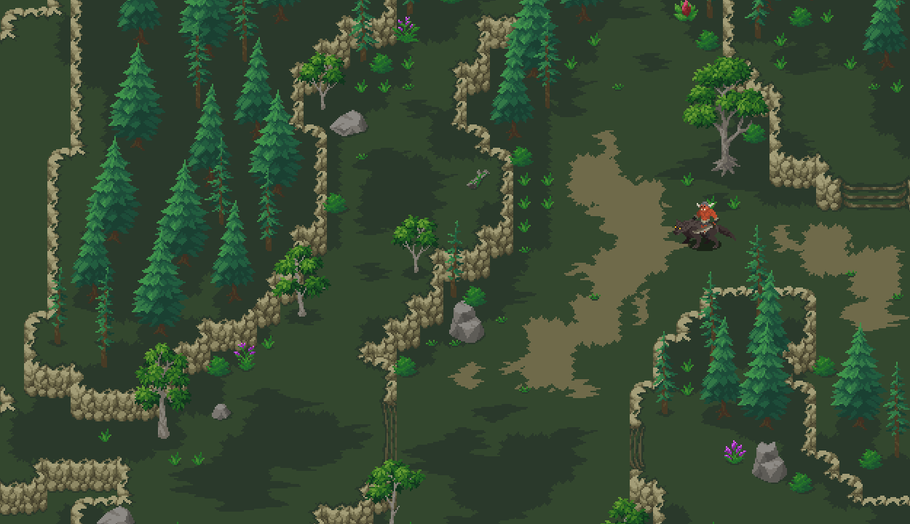
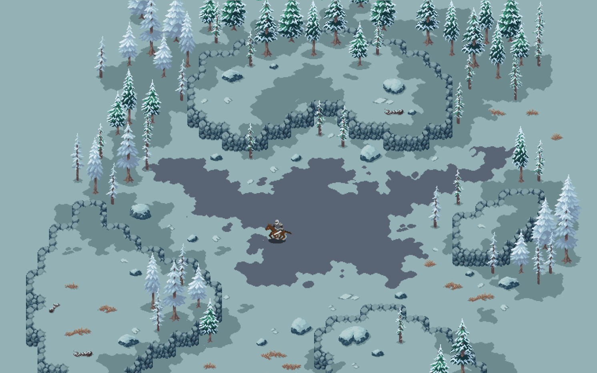

# Procedural Terrain Generation

## Features

- **Procedural Generation**: 
    - The terrain is generated procedurally using noise functions, ensuring unique and diverse landscapes every time.
    - Utilizes Perlin noise and other noise functions to generate realistic terrain heights and features
    - Supports multiple octaves and customizable noise settings for fine-tuning the generated terrain
- **Chunk-based Loading**: 
    - The terrain is divided into chunks, allowing for efficient loading and unloading based on the camera's position.
    - Chunks are generated asynchronously to ensure a smooth gameplay experience
    - Only visible chunks are rendered, optimizing performance and memory usage
- **Biome Distribution**: 
    - The terrain is automatically divided into different biomes based on height, moisture, and temperature values.
    - Biomes include desert, grassland, forest, tundra, and more
    - Each biome has its own unique characteristics and tile types
- **Tilemap Rendering**: 
    - The generated terrain is rendered using Unity's Tilemap system, providing flexibility and optimization.
    - Different tile types are used to represent various terrain features and biomes
    - Tilemap colliders are automatically generated for collision detection
- **Quadtree Optimization**: 
    - A quadtree data structure is employed for efficient spatial queries and optimization.
    - Enables fast retrieval of terrain data based on location
    - Optimizes collision detection and other spatial operations
- **Asynchronous Generation**:  
    - The terrain generation process is performed asynchronously, ensuring a smooth and responsive gameplay experience.
    - Utilizes coroutines and multithreading to generate terrain without freezing the main thread
    - Provides a progress indicator to display the generation progress
- **Customizable Settings**: 
    - The terrain generation system offers a wide range of customizable settings to fine-tune the desired output.
    - Adjust noise settings, chunk size, biome distribution, and more
    - Experiment with different seed values to generate unique terrain variations

## Getting Started

To get started with the procedural terrain generation system, follow these steps:

1. Clone the repository: `git clone https://github.com/YegorCherov/procedural-terrain-generation.git`
2. Open the project in Unity.
3. Explore the `Scenes` folder and open the main scene.
4. Adjust the terrain generation settings in the `MapGenerator` script inspector.
5. Press the "Play" button to start the game and witness the procedurally generated terrain.

## Scripts

### MapGenerator Script
- `MapGenerator.cs`: Orchestrates the overall terrain generation process and manages chunk loading.

### TerrainGenerator Script
- `TerrainGenerator.cs`: Responsible for generating the terrain heightmap and applying noise functions.

### TilemapGenerator Script
- `TilemapGenerator.cs`: Handles the rendering of the generated terrain using Unity's Tilemap system.
 
### Noise Script
- `Noise.cs`: Implements various noise functions and noise settings used for terrain generation.

## Terrain Generation Process

The terrain generation process follows these key steps:

1. **Noise Map Generation**: The `TerrainGenerator` script generates noise maps using Perlin noise and other noise functions based on the specified noise settings.

2. **Biome Distribution**: The generated noise maps are used to determine the distribution of biomes across the terrain, taking into account height, moisture, and temperature values.

3. **Chunk Generation**: The terrain is divided into chunks, and each chunk is generated asynchronously using the `MapGenerator` script. The script utilizes coroutines and multithreading to ensure a smooth generation process.

4. **Tilemap Rendering**: The `TilemapGenerator` script takes the generated terrain data and renders it using Unity's Tilemap system. Different tile types are used to represent various terrain features and biomes.

5. **Chunk Loading**: As the player moves around the terrain, the `MapGenerator` script dynamically loads and unloads chunks based on the camera's position. Only visible chunks are rendered to optimize performance.

## Screenshots

Here are some screenshots showcasing the procedurally generated terrain:

*Caption: A vast desert biome with scattered vegetation*

*Caption: A lush forest biome with dense trees and foliage*

*Caption: A snowy tundra biome with icy terrain and frozen lakes*

## Future Enhancements

Here are some potential future enhancements for the procedural terrain generation system:

- **Additional Biomes**: Expand the range of biomes to include more diverse and unique environments, such as swamps, mountains, and beaches.
- **Procedural Foliage**: Integrate procedural foliage generation to populate the terrain with realistic trees, grass, and other vegetation.
- **Erosion Simulation**: Implement erosion simulation algorithms to create more natural-looking terrain features, such as rivers, canyons, and cliffs.
- **Performance Optimization**: Further optimize the terrain generation and rendering process to support larger terrains and higher levels of detail.
- **User Interface**: Develop a user-friendly interface to allow easy customization of terrain generation settings and real-time previews.

## Credits

The procedural terrain generation system was developed by Rozcy using Unity and C#.

The project utilizes the following third-party assets and resources:

- [Perlin Noise](https://docs.unity3d.com/ScriptReference/Mathf.PerlinNoise.html) - Built-in Unity function for generating Perlin noise.
- [Unity Tilemap](https://docs.unity3d.com/Manual/class-Tilemap.html) - Unity's built-in 2D tilemap system for efficient rendering.
- [Graphics](https://sanctumpixel.itch.io/) - 2D Pixel Art

## License

This project is licensed under the [MIT License](LICENSE).
